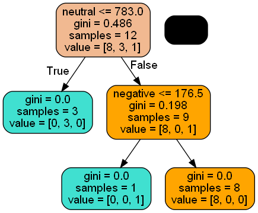
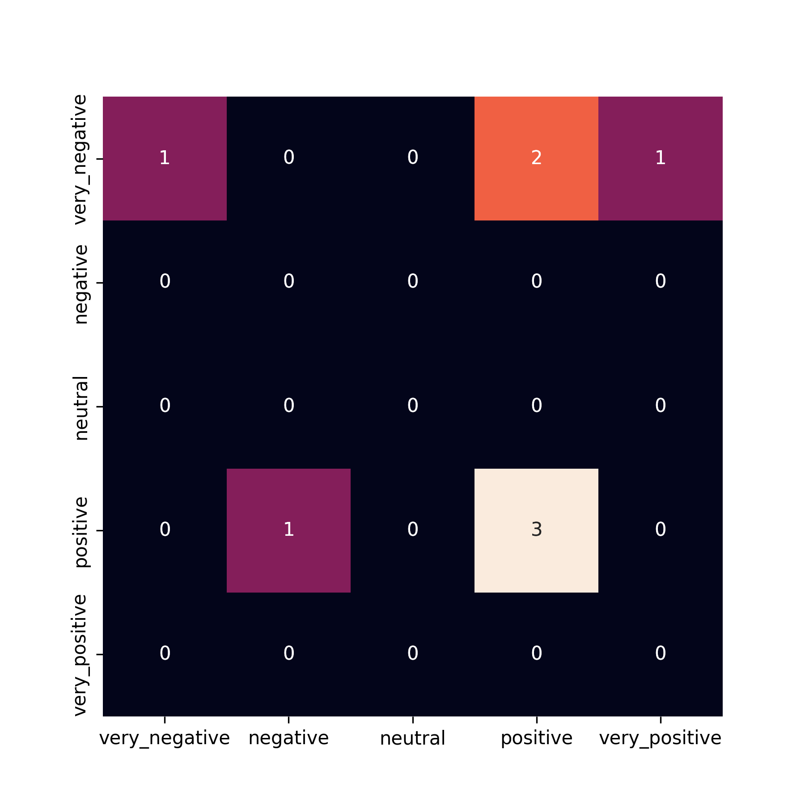

# MSDS696 Data Science Practicum 2

This is a continuation of MSDS692, available here: https://github.com/chef55555/MSDS692

This is a two part project, part 1, linked above; is about collecting and scoring the tweets.

Part two, this part, involves using machine learning to discover if tweet sentiment can predict changes in stock price. 

For more details see my presentation here: https://youtu.be/-cghOmk0jVY






## Instructions to run these files</h2>

Run all files from inside the /src folder.

Install requirements
```shell
pip install -r requirements.txt
```

analysis.py loads the  the data and runs it through a Decision Tree classifier and a Random forest classifier

It will produce four images as output, confusion matrices. It will also write some of the other data to file that I used for charting.

To run it:
```shell
python scrape_tweets.py
```